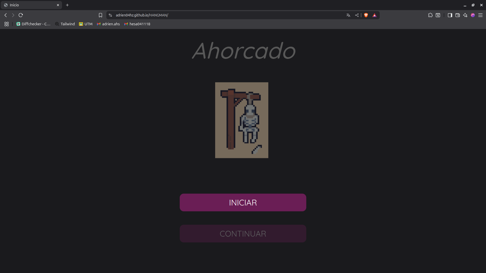

# JUEGO DEL AHORCADO

Proyecto realizado el `3 de diciembre del 2024` para la asignatura de Programación web. Se utilizaron tecnologías como CSS, HTML, JavaScript y Bootstrap.

Además se utilizan canvas para ciertas animaciones que se utilizan dentro del juego.

### DEMOSTRACIÓN

Dar clic en la imagen para probar el juego.

